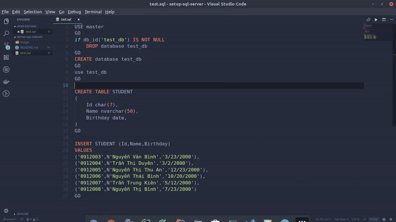

# SQL Database: Use Visual Studio Code to connect and query data.
This script follow [here](https://docs.microsoft.com/en-us/sql/linux/quickstart-install-connect-ubuntu?view=sql-server-2017)
# Step 1
```bash
# Install wget
sudo apt-get install wget
# Install SQL Server
wget -qO- https://packages.microsoft.com/keys/microsoft.asc | sudo apt-key add - # Import the public repository GPG keys
add-apt-repository "$(wget -qO- https://packages.microsoft.com/config/ubuntu/16.04/mssql-server-2017.list)" # Register the Microsoft SQL Server Ubunt$

# Run the following commands to install SQL Server
sudo apt-get update -y 
sudo apt-get install -y mssql-server -y
/opt/mssql/bin/mssql-conf setup

```
# Step 2
``` bash
# Install the SQL Server command-line tools
curl https://packages.microsoft.com/keys/microsoft.asc | sudo apt-key add - # Import the public repository GPG keys.
curl https://packages.microsoft.com/config/ubuntu/16.04/prod.list | sudo tee /etc/apt/sources.list.d/msprod.list # Register the Microsoft Ubuntu repo$ 

# Update the sources list and run the installation command with the unixODBC developer package.
sudo apt-get update 
sudo apt-get install mssql-tools unixodbc-dev

# Add /opt/mssql-tools/bin/ to your PATH environment variable in a bash shell.
echo 'export PATH="$PATH:/opt/mssql-tools/bin"' >> ~/.bash_profile
echo 'export PATH="$PATH:/opt/mssql-tools/bin"' >> ~/.bashrc
source ~/.bashrc
```
# Step 3: Using SQL with VS Code
- Copy this line `ext install ms-mssql.mssql`
- Open vscode `code`
- Ctrl + p, Ctrl + v and Enter
- Next: 

